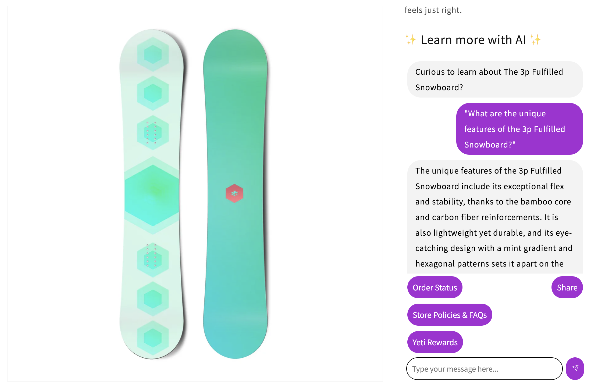
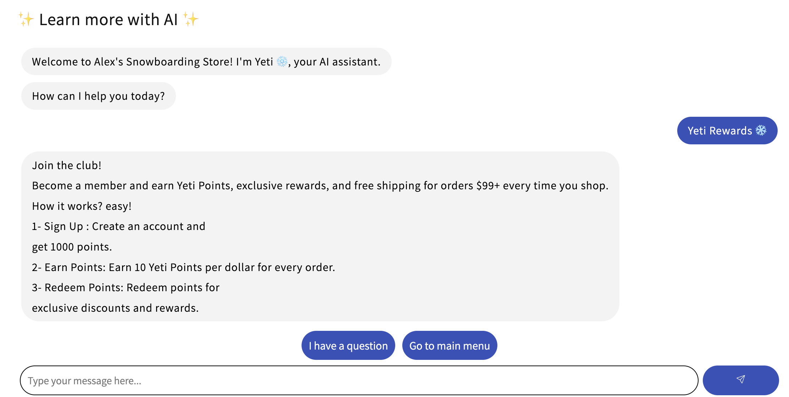
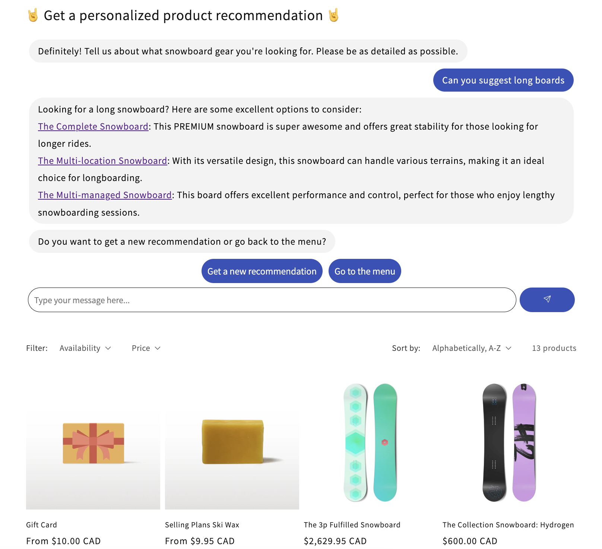

# Voiceflow-In-Store for Shopify

A Shopify theme app extension for Voiceflow that allows you to integrate any advanced AI agent you want to build into your e-commerce store.

Connect your Voiceflow Agent to your Store to enable AI driven contextual conversations. See a demo video of the integration [here](https://youtu.be/o-D4X1QCUv4) and an a development walkthrough [here](https://youtu.be/PQpQVdaGVtU).

## Features

- **Voiceflow integration**: Integrate any Voiceflow agent into your Shopify store, connect with the best customizable platform for building conversational AI agents.
- **Dynamic content**: Serve dynamic content to your users based on the context in which the page is being loaded using `pageSlug` to jump to differnt contexts and `product` information.
- **Get context specific answers**: Give your AI agent context of where it is on the website for more accurate answers and seamless conversations.
- **Custom buttons**: Built-in Add to Cart buttons that your agent can serve to drive sales.
- **Shopify native**: Built into your shopify page so it's fully dynamic and customizable like any other app, with colour, and text options.

## Setup

- `cd shop-extension`
- Install NodeJS 22, latest Ruby, create a Shopify Partner Account, install Shopify CLI and Sign In 
- Make your shopify development store
- Run `npm install` to install the dependencies
- Delete everything inside `shopify.app.toml` except the first comment
- Run `npm run dev` to start the development server, choose to 
- Import the `Shopify-In-Store-Full-Demo.vf` template into your Voiceflow workspace
- Update the API key as well as the ProjectID and VersionID from your Voiceflow project and update them at the top the `shop-extension/extensions/voiceflow-extension/assets/chat-box.js` file
- Add your Policy and Rewards to KB and add Streamline Connector to your Shopify store to sync the products
- From inside your Voiceflow project, also update the variable that stores the API key
- Customise the flow as you would like

